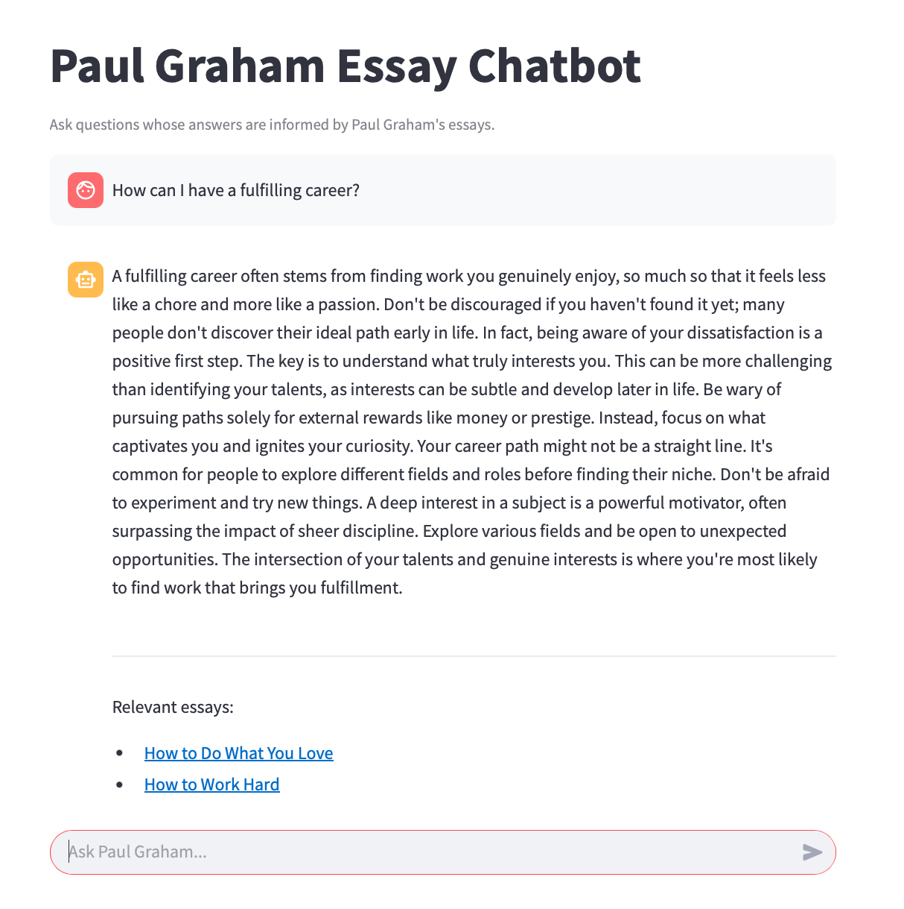

# RAG chatbot
This repository implements Retrieval-Augmented Generation for Paul Graham's essays. Users can ask one question (`one_shot/`) or interactively ask multiple questions (`multi_shot/`). The LLM being used is Gemini.

Directories:
* `data/`: contains the web scraping script to obtain all of Paul Graham's essays.
* `one_shot/`: can only ask one question (and receive one answer).
* `multi_shot/`: can interactively ask multiple questions. Use streamlit to run code, i.e. `streamlit run interactive.py`

<figure style="text-align: center;">
  
  <figcaption><em>Figure: Chatbot answering the user-inputted question: "How can I have a fulfilling career?"</em></figcaption>
</figure>

---
Acknowledgments: The impetus for this project stems from completing a worksheet titled, "Understanding and Applying LLMs" by Mobolaji Williams. Gemini and ChatGPT were used to help write the code.
